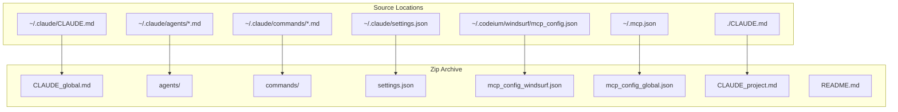
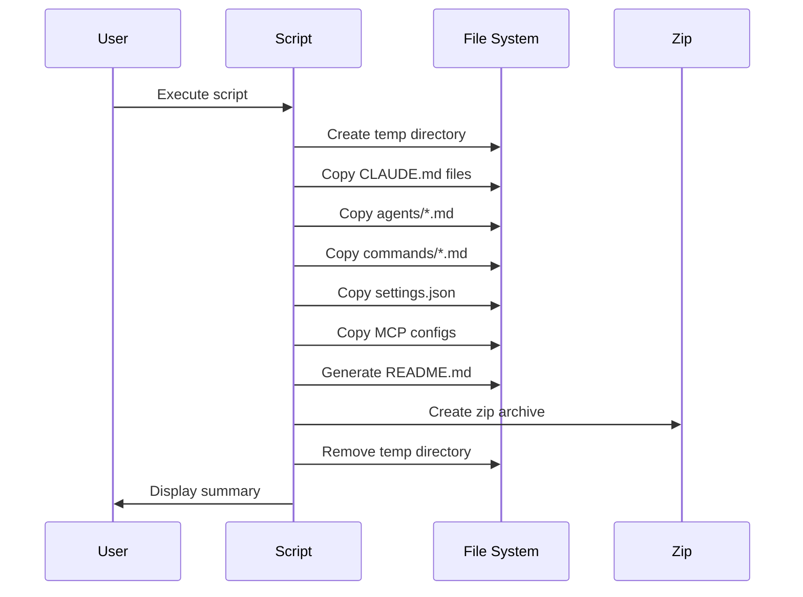

# Claude Code Configuration Exporter

**Date**: 2025-12-26
**Document**: claude_config_exporter.md

## Overview

The `export_claude_config.sh` script creates a portable zip archive containing all global Claude Code configuration files. This enables backup, sharing, and restoration of your Claude Code customizations across machines.

## What Gets Exported



## File Categories

| Category | Source | Destination | Description |
|----------|--------|-------------|-------------|
| Global Instructions | `~/.claude/CLAUDE.md` | `CLAUDE_global.md` | Global agent behavior rules |
| Project Instructions | `./CLAUDE.md` | `CLAUDE_project.md` | Current project's instructions |
| Agents | `~/.claude/agents/*.md` | `agents/` | Custom agent definitions |
| Commands | `~/.claude/commands/*.md` | `commands/` | Slash commands/skills |
| Settings | `~/.claude/settings.json` | `settings.json` | Claude Code preferences |
| MCP (Windsurf) | `~/.codeium/windsurf/mcp_config.json` | `mcp_config_windsurf.json` | Windsurf MCP servers |
| MCP (Global) | `~/.mcp.json` | `mcp_config_global.json` | Global MCP servers |

> **Note**: Project-specific `.mcp.json` files are intentionally excluded to keep exports portable.

## Usage

### Running the Script

```bash
# Navigate to the project directory
cd /Users/laht/projects/AIAgency

# Execute the script
./export_claude_config.sh
```

### Output

The script creates a timestamped zip file:

```
claude_config_YYYYMMDD_HHMMSS.zip
```

## Script Workflow



## Exported Archive Structure

```
claude_config_YYYYMMDD_HHMMSS/
├── CLAUDE_global.md          # Global instructions
├── CLAUDE_project.md         # Project instructions (if present)
├── agents/
│   ├── Explorer.md
│   ├── ai-engineering-expert.md
│   ├── data-engineering-expert.md
│   ├── data-intensive-architect.md
│   ├── data-science-specialist.md
│   ├── legal-compliance-eu.md
│   ├── marketing-seo-specialist.md
│   ├── mlops-engineer.md
│   ├── nextjs-best-practices-researcher.md
│   ├── openai-agents-sdk-specialist.md
│   ├── payload-cms-auditor.md
│   ├── python-senior-dev.md
│   ├── scalability-expert.md
│   └── security-expert.md
├── commands/
│   ├── check.md
│   ├── close_day.md
│   ├── codebase.md
│   ├── commit.md
│   ├── index_graph.md
│   ├── open_day.md
│   ├── remember.md
│   ├── roadmap.md
│   ├── search.md
│   ├── security_review.md
│   ├── status.md
│   └── update_graph.md
├── settings.json
├── mcp_config_windsurf.json  # If present
├── mcp_config_global.json    # If present
└── README.md                 # Auto-generated documentation
```

## Restoring Configuration

To restore the exported configuration on another machine:

```bash
# Extract the archive
unzip claude_config_YYYYMMDD_HHMMSS.zip
cd claude_config_export_YYYYMMDD_HHMMSS

# Restore global CLAUDE.md
cp CLAUDE_global.md ~/.claude/CLAUDE.md

# Restore agents
mkdir -p ~/.claude/agents
cp agents/*.md ~/.claude/agents/

# Restore commands
mkdir -p ~/.claude/commands
cp commands/*.md ~/.claude/commands/

# Restore settings
cp settings.json ~/.claude/

# Restore MCP config (choose appropriate one)
cp mcp_config_windsurf.json ~/.codeium/windsurf/mcp_config.json
# OR
cp mcp_config_global.json ~/.mcp.json
```

## Error Handling

The script handles missing files gracefully:

| Condition | Behavior |
|-----------|----------|
| Missing `~/.claude/CLAUDE.md` | Warning displayed, continues |
| Missing `./CLAUDE.md` | Info displayed, continues |
| Empty agents directory | Info displayed, continues |
| Empty commands directory | Info displayed, continues |
| No MCP configs found | Info displayed, continues |

## Requirements

- Bash shell
- `zip` command available
- `unzip` command (for displaying contents)

## Security Considerations

The exported archive may contain:

- **MCP API keys** in `mcp_config_*.json` files
- **Custom instructions** that reference internal systems

**Recommendations**:
- Review MCP configs before sharing
- Store exports in secure locations
- Regenerate API keys after sharing if necessary
