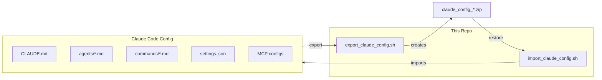

# Claude Code Configuration Manager

Portable backup and restore scripts for Claude Code configuration files (agents, commands, settings).

## Quick Start

```bash
# Export your config
./export_claude_config.sh

# Import on another machine
./import_claude_config.sh claude_config_*.zip
```

## What Gets Managed



## File Locations

| Component | Location | Description |
|-----------|----------|-------------|
| Global CLAUDE.md | `~/.claude/CLAUDE.md` | Global agent behavior rules |
| Agents | `~/.claude/agents/*.md` | Custom agent definitions |
| Commands | `~/.claude/commands/*.md` | Slash commands/skills |
| Settings | `~/.claude/settings.json` | Claude Code preferences |
| Claude Config | `~/.claude.json` | MCP servers, user preferences, project settings |

---

## Export Script

### Usage

```bash
./export_claude_config.sh
```

### What It Does

1. Copies global `CLAUDE.md` from `~/.claude/`
2. Copies project `CLAUDE.md` from current directory (if exists)
3. Copies all agents from `~/.claude/agents/`
4. Copies all commands from `~/.claude/commands/`
5. Copies `settings.json`
6. Copies global MCP configurations (not project-specific)
7. Creates timestamped zip file

### Output

```
claude_config_YYYYMMDD_HHMMSS.zip
```

---

## Import Script

### Usage

```bash
# Auto-detect zip in current directory
./import_claude_config.sh

# Or specify zip file
./import_claude_config.sh /path/to/claude_config_*.zip
```

### What It Does

1. Extracts the zip archive
2. Creates `~/.claude/agents/` and `~/.claude/commands/` if needed
3. Backs up existing files before overwriting
4. Imports CLAUDE.md, agents, commands, and settings
5. Imports claude.json (MCP servers config)

### Features

- **Auto-backup**: Existing files are backed up with `.bak` extension
- **Full MCP import**: claude.json is auto-imported with backup of existing config
- **Color output**: Clear status indicators
- **Temp directory cleanup**: Automatic cleanup on exit

---

## Archive Structure

```
claude_config_YYYYMMDD_HHMMSS/
├── CLAUDE_global.md          # Global instructions
├── CLAUDE_project.md         # Project instructions (if present)
├── agents/
│   ├── Explorer.md
│   ├── ai-engineering-expert.md
│   ├── security-expert.md
│   └── ... (more agents)
├── commands/
│   ├── commit.md
│   ├── search.md
│   └── ... (more commands)
├── settings.json
├── claude.json               # MCP servers config
└── README.md
```

---

## Cross-Machine Migration

### On Source Machine

```bash
git clone https://github.com/lehidalgo/claude-settings-zip.git
cd claude-settings-zip
./export_claude_config.sh
# Transfer the zip file to target machine
```

### On Target Machine

```bash
# Install Claude Code first
git clone https://github.com/lehidalgo/claude-settings-zip.git
cd claude-settings-zip
# Copy your zip file here
./import_claude_config.sh claude_config_*.zip
# Restart Claude Code
```

---

## Requirements

- Bash shell
- `zip` / `unzip` commands
- Claude Code installed (for import to work)

---

## Security Notes

The exported archive may contain:

- **MCP API keys** in `claude.json`
- **Custom instructions** that reference internal systems

**Recommendations**:
- Review claude.json before sharing publicly
- Store exports in secure locations
- Regenerate API keys if sharing with others
- The `.gitignore` prevents accidental zip commits

---

## License

MIT
